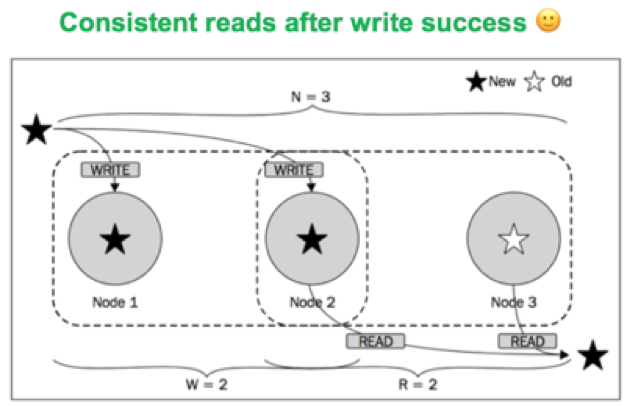

## Reads inconsisitent example even with W + R > N



## Lightweight Transactions = Extremely High Latency
Compare And Set (CAS) operations need consensus.  
When you use `IF NOT EXISTS` or `IF` statement in the cassandra, cassandra will upgrade its consistency protocal to Paxos automatically which requires large communication between nodes.
So you will suffer high latency if you use these operations without thinking.
``` sql
INSERT INTO payments (payment_time, customer_id, amount)
VALUES (2017-11-02 12:23:34Z, 126, 15.00)
IF NOT EXISTS;
```
``` sql
UPDATE payments SET amount = 20.00
WHERE payment_date = 2017-11-02 12:23:34Z
AND customer_id = 126
IF amount = 15.00
```

## Secondary Indexes = Poor Performance
A primary index is global in the sense that every node knows which node has the data for the key being requested. However, secondary index is local to every node and every read with secondary indexes has to read from disk on ALL nodes.

## Reference
[Apache Cassandra: The Truth Behind Tunable Consistency, Lightweight Transactions & Secondary Indexes](https://blog.yugabyte.com/apache-cassandra-lightweight-transactions-secondary-indexes-tunable-consistency/)