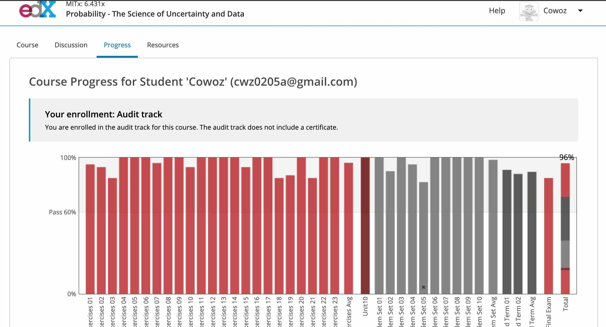
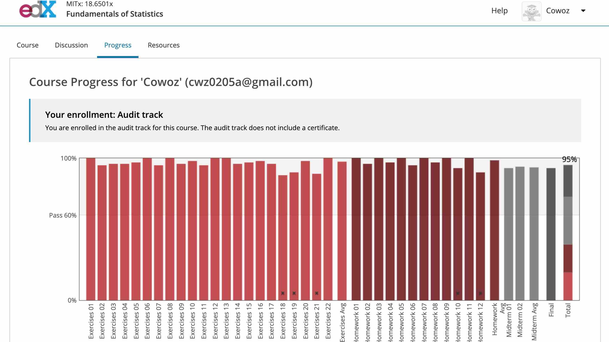
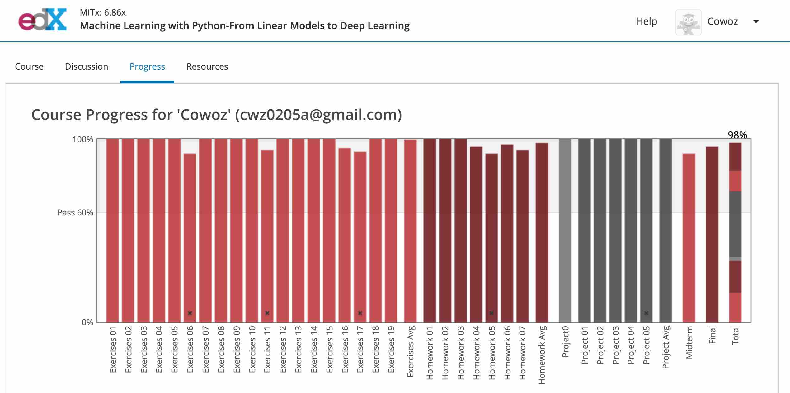

學習各種技術是我的興趣, 現在有很多線上課程, 這篇文章就記錄我完整學習完畢並覺得不錯的課程
我推薦的課程大多數是實際大學的課程, 所以內容上會比一般常見的MOOC多且難, 但絕對值得

## 線上課程連結
* MIT MOOC系列
    + [18.01sc - Single Variable Calculus](https://ocw.mit.edu/courses/mathematics/18-01sc-single-variable-calculus-fall-2010/)
    + [18.02sc - Mutivariable Calculus](https://ocw.mit.edu/courses/mathematics/18-02sc-multivariable-calculus-fall-2010/)
    + [18.06sc - Linear Algebra](https://ocw.mit.edu/courses/mathematics/18-06sc-linear-algebra-fall-2011/)

* Edx Statistics and Data Science micro master program
    + [6.431x - Probability - The Science of Uncertainty and Data](https://courses.edx.org/courses/course-v1:MITx+6.431x+3T2018/course/)
    + [18.6501x - Fundamentals of Statistics](https://courses.edx.org/courses/course-v1:MITx+18.6501x+3T2018/)
    + [6.86x - Machine Learning with Python-From Linear Models to Deep Learning](https://courses.edx.org/courses/course-v1:MITx+6.86x+1T2019/course/)
    
* Stanford 系列
    + [cs231n Convolutional Neural Networks for Visual Recognition](http://cs231n.stanford.edu/)
    + [cs224n Natural Language Processing with Deep Learning](https://web.stanford.edu/class/cs224n/)
    + [cs234n Reinforcement Learning](http://web.stanford.edu/class/cs234/index.html)

* Fastai系列
    + [Practical Deep Learning for Coders](http://course.fast.ai/)
    + [Deep Learning from the Foundations](http://course.fast.ai/part2)
    + [Introduction to Machine Learning for Coders](http://course18.fast.ai/ml)
    + [A Code-First Introduction to Natural Language Processing](https://www.fast.ai/2019/07/08/fastai-nlp/)

* 李宏毅系列
    + [Machine Learning](http://speech.ee.ntu.edu.tw/~tlkagk/courses_ML20.html)
    + [Machine Learning and having it deep and structured](http://speech.ee.ntu.edu.tw/~tlkagk/courses_MLDS18.html)
    + [Deep Learning for Human Language Processing](http://speech.ee.ntu.edu.tw/~tlkagk/courses_DLHLP20.html)

* 其他
    + [Berkeley cs188 Introduction to Artificial Intelligence](https://inst.eecs.berkeley.edu/~cs188/fa18/)
    + [David Silver Reinforcement Learning](http://www0.cs.ucl.ac.uk/staff/d.silver/web/Teaching.html)
    + [Fullstack Deep Learning](https://fullstackdeeplearning.com/march2019)

## 推薦的ML + DL學習路徑
1. Math Fundation: MIT 18.01sc, 18.02sc, 18.06sc, Edx 6.431x, 18.6501x
2. Machine Learning: fastai ML
3. Deep Learning: fastai DL, Stanford cs231n, cs224n, fullstack deep learning
4. Reinforcement Learning: David Silver RL, Stanford cs234n or Berkeley cs285
5. All in one: 李宏毅系列

## Edx micro master program achievement
Edx的Statistics and Data Science micro master program在所有MOOC中算是偏困難的, 因為他就是MIT的校園課程, 作業與考試也完全比照校園版難度並重新設計, 網路上你也找不到任何解答, 因此我這邊特地記錄一下我當時拿到的分數, 算是小小的自豪一下

6.431x分數

18.6501x分數

6.86x分數

