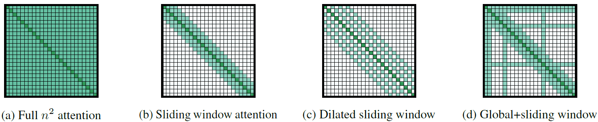

一般來說pretrained Bert只能處理token長度小於512的input, 而pretrained GPT2只能處理長度小於1024的input.  
Token長度必須固定的原因在Positional encoding, 這個數字不能太大的原因是Global attention.  
假設input sequence length是n, 在self attention中我們將產生n^2的weight matrix.  
Longformer最大的不同之處就是將global attention換成local attention, 我們就只需要產生n的sparse weight matrix.

(a)是global attetion, (d)是longformer的local attention + 有限的global attention

將多個local attention layer疊起來, 效果就像CNN一樣, 後面的receptive field會慢慢變大, 最後他還是可以包含到整個seqence的資訊

哪些token適合global attention? Ex: Bert中用來做classification的[CLS]

## Reference
* [Longformer original paper](https://arxiv.org/abs/2004.05150)
* [Longformer explained video by Yannic Kilcher](https://www.youtube.com/watch?v=gJR28onlqzs)