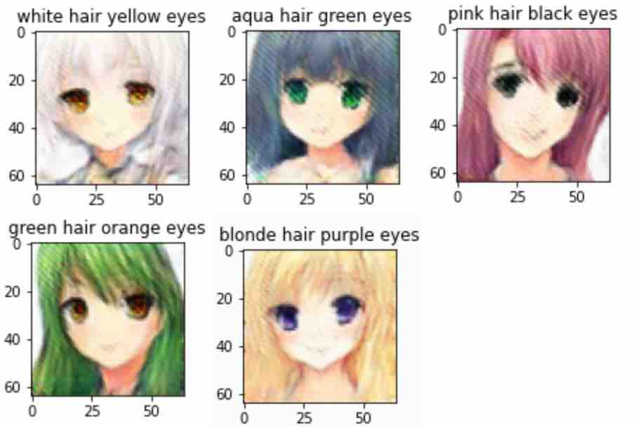
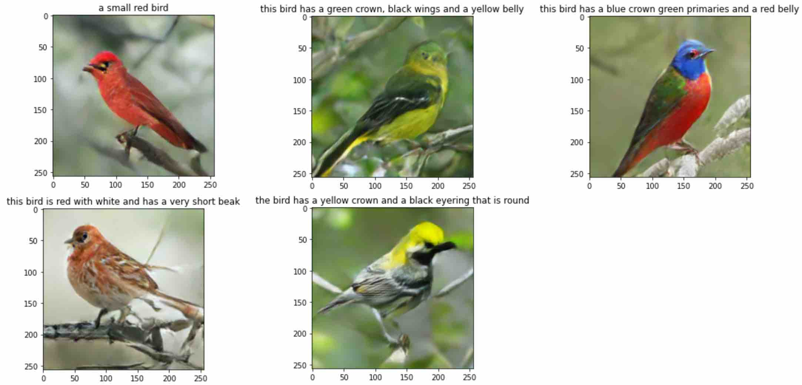
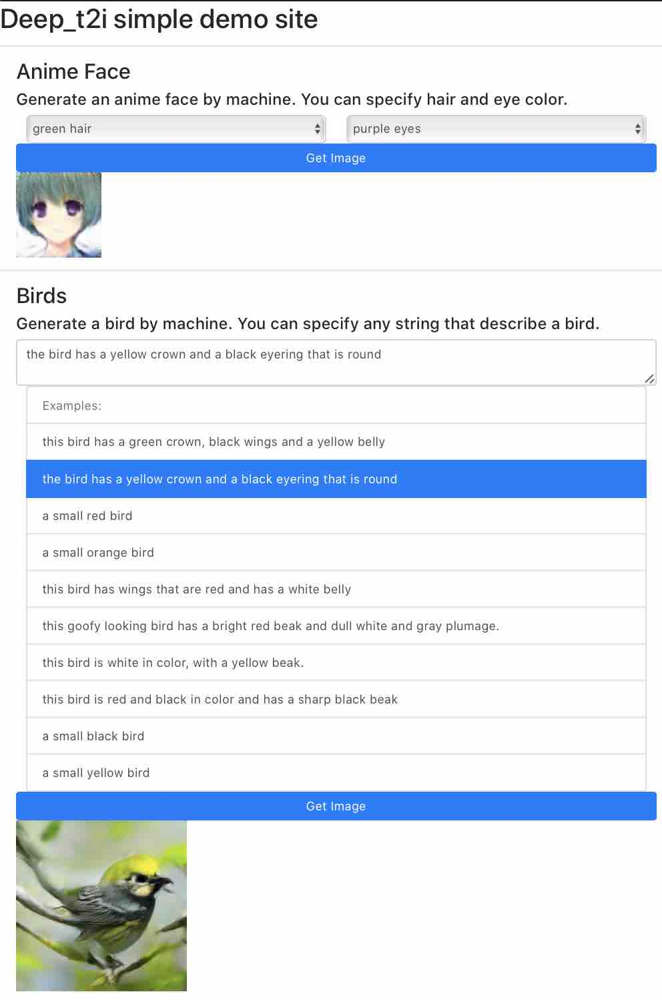
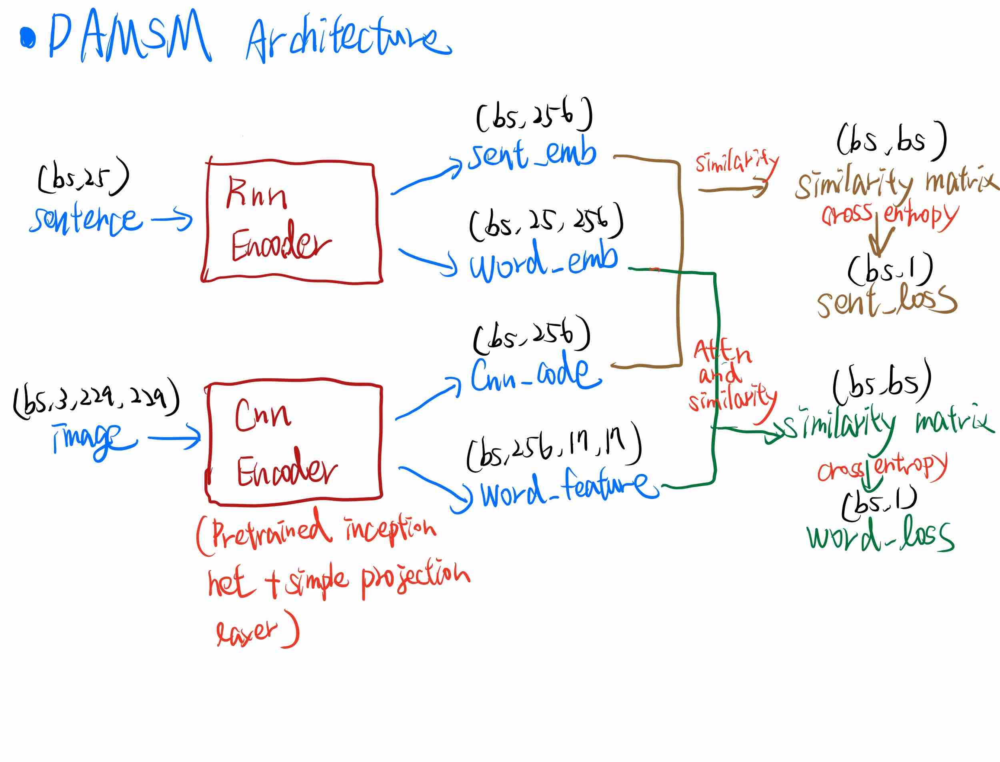
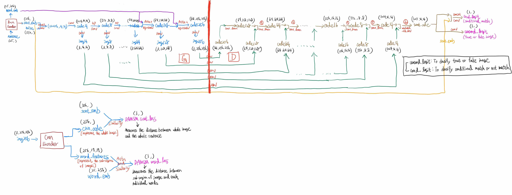

## Goal
1. Generate 256x256 bird image from natural text.
2. Generate 64x64 anime faces image from specific tags.

---

## Selected Result

Notice that for birds dataset, the results are not always good. The followings are which I choosed that looks good.

---

## Demo web interface
https://github.com/cwza/deep_t2i_web

---

## Model architecture

---

## Datasets
* Birds
    + [CUB-200](http://www.vision.caltech.edu/visipedia/CUB-200-2011.html)
    + [Birds Captions from AttnGAN](https://drive.google.com/open?id=1O_LtUP9sch09QH3s_EBAgLEctBQ5JBSJ)
* Anime faces
    + [Simple anime faces data](https://drive.google.com/uc?export=download&id=1tpW7ZVNosXsIAWu8-f5EpwtF3ls3pb79)
    + This data is from this [course](http://speech.ee.ntu.edu.tw/~tlkagk/courses_MLDS18.html) 

---

## Source code and more
* Training on P100 GPU, Flask api is deployed at Google Cloud Run, Web is deployed to Github Page
* [Training code and Model architecure](https://github.com/cwza/deep_t2i)
* [Flask api server](https://github.com/cwza/deep_t2i/tree/master/server)
* [Web interface](https://github.com/cwza/deep_t2i_web)

---

## Reference
* [Attn-GAN](https://github.com/taoxugit/AttnGAN)
* [MSG-GAN](https://github.com/akanimax/BMSG-GAN)
* [SA-GAN](https://arxiv.org/abs/1805.08318)
* [Pro-GAN](https://arxiv.org/abs/1710.10196)